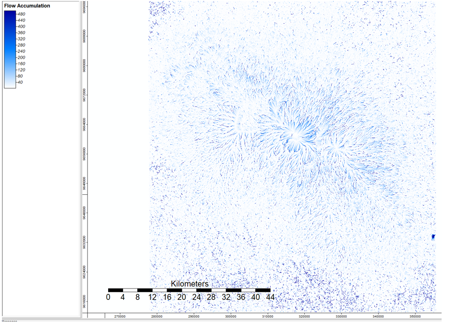

In this lab, we created a hydrological flow model for the Kilimanjaro region.

First, we downloaded a Digital Elevation Model (DEM) from EarthData. I chose to use data collected by NASA Shuttle Radar Topography Mission (STRM).

 

Next, I performed a hillshade analyses in order to view the elevation changes in the terrain more clearly.

 

Next, I used the Sink Drainage Route tool to detect sinks (real or in the form of data holes) in the landscapes to prevent my hydrological analyses from taking those into acount. 

Aftet establishing where sink holes existed in the data, I "filled" them using the Sink Removal Tool. Then I was able to use the Flow Accumulation (Top-Down) to determine where the water will go. As you can see below, the vast majority of the lanscape is white, indicating that very few locations in the area contain water that flow to that spot. The dark blue lines indicate river heads where waters from many locations meet.

 

Finally, I used the Channel Network tool to define where the streams are/will be in the region.

