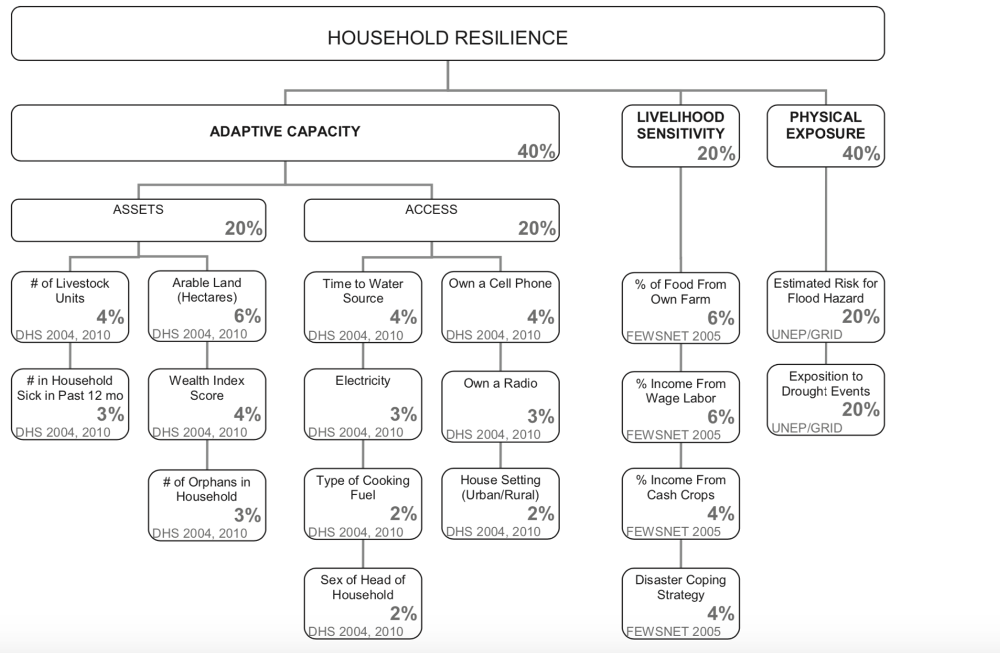
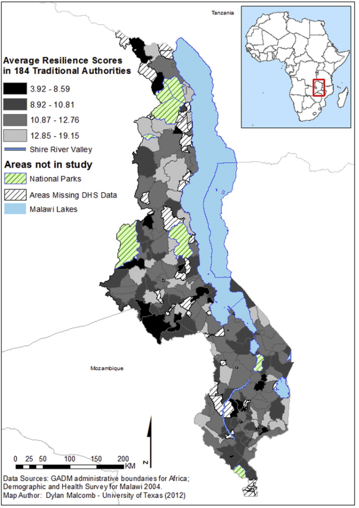
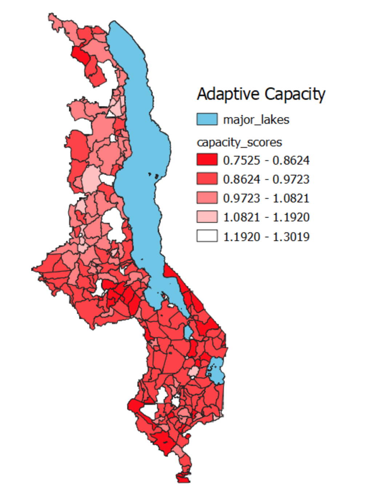
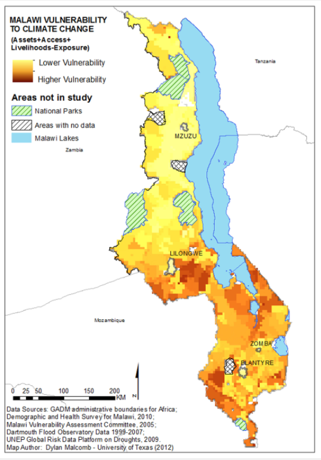
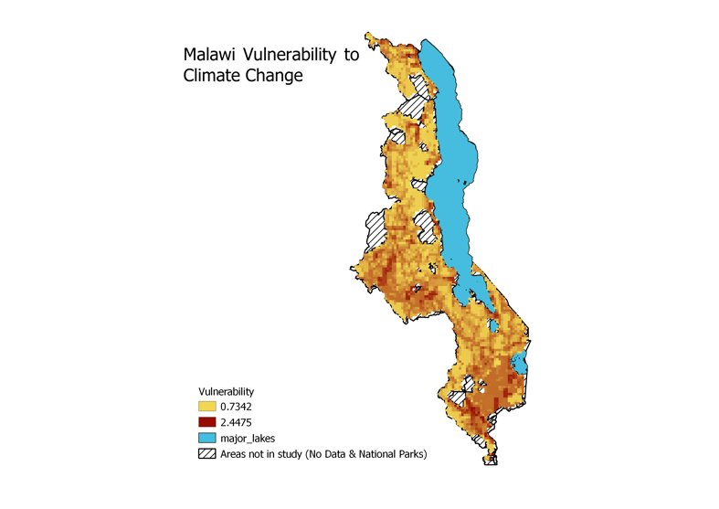

# An Excersize in Reproducibility and Replicability: Vulnerability and Resilience in Malawi

For this lab, we sought to examine the feasability of reproducing an academic study that used GIS. Reproducibility is critical in GIS studies, and in scientific studies in general. It refers to the ability for someone to read the study and use those same methods to find the same results. Replicability means that the reader can use those same methods and apply it to another geographic location. Reproducibility holds authors accountable to their audience and generates further knowledge and discussion. Unfortunately, true reproducability in scientific studies is extremely rare. Reproducing studies that deal with vulnerability is particularly challenging because there are not good cross-discipline standards for assessing vulnerability. Additionally, indicators of vulnerability vary widely across space and time so replicability is also a challenge. 

Here is Malcomb et al.'s diagram of household resilience:

 

## The Study

We choose to attempt to reproduce a 2014 called "Vulnerability modeling for sub-Saharan Africa: An operationalized approach in Malawi" by Dylan W. Malcomb, et al. This study used a multi-criteria analyses to analyze the drivers of vulnerability at a household level in Malawi with the aim of creating climate-related policy that is specificly tailored to the country's most vulnerable regions. The authors determined a final vulnerability score by combining independently calculated adaptive capacity and livelihood sensitivity scores and subtracting from that a score of physical exposure. They first determined these scores by conducting interviews with members of households regarding their perceptions of climate change, their own capacities to adapt, governance, vulnerability, and foreign aid, among many other topics. They then assessed the relative importance of a large array of factors that contribute to a household's adaptive capacity and sensitivy including but not limited to number of sick people in a house, ownership of a cellphone, and access to food and water. Malcom et al. then normalized each indicator from 0 to 5 to represent the relative condition of a household for that specific variable. They then disaggregated these indicators to the village level and then combined them to assess vulnerability at the Traditional Authorities scale. 

## Reproduction Methodology

### Data
For this lab, we used data from a variety of sources.

* The global flood risk layer from UNEP GLobal Risk Map. We choose to use the global map rather than the one for Malawi because the Malawi one appeared to have incorrect polygons.
* Malawi drought physical exposure layer from UNEP Global Risk Map.
* DHS Cluster Points from the DHS website
* DHS Survey Data from the DHS website
* [FEWSNET Livelihood Zones](http://fews.net/fews-data/335) 
* [Major Lakes](www.masdap.mw/layers/geonode:major_lakes) from Open Street Map, using MASDAP
* [DHS Survey Region boundaries](spatialdata.dhsprogram.com/boundaries/#view=table&countryID=MW) 

We performed our analyses using QGIS Desktop verson 3.8.1 with GRASS 7.6.1. We used CRS WGS 84 (EPSG: 4326). 

Check out the SQL I used to perform this analyses [here](vulnerabilitySQL.sql) 

### Adaptive Capacity: Summarizing DHS Surveys by Traditional Authority

In order to reproduce this complicated first step, we first downloaded the DHS survey metadata and collaboratively extracted the variables that Malcom et al. used in their analyses. We then wrote sql to code these variables into quantiles. First, we had to drop the no data and null values. We had to determine whether 1 or 5 would be the high value depending on the nature of the variable. This proved to be complicated when we were dealing with a binary variable such as cell phone ownership. Below is my map of household resilience followed by that of Malcomb, et al. 

 

### Sensitivity

We were unable to reproduce Malcomb et al.'s sensitivity analyses because we cannot access the data from FewsNET 2005. Our final analyses is therefore only 80% of Malcomb's, with the remaining 20% being a sensitivity analyses. 

### Exposure 

For this part of the analyses we downladed the global data layer from the UNEP website and loaded the layers into POSTGIS with a raster2pgsql command-line program. Then we had to clip (st_clip) areas like major lakes and national parks that were not included in Malcomb et al.'s work. The dought and flood data come in different sized raster resolutions (0.0416 vs 0.0833 decimal degrees for drought and flood risk, respectively). In order to resample the layers to match each other we used "warp cell size" with bilinear resampling. 

Finally, we recoded both layers to be on a quantile scale, like our indicators for adaptive capacity and vulnerability. The values for the flood risk layer were already 0 to 4 so we just had to add 1 in the raster calculator to normalize the values to 1 to 5, like in Malcomb et al.'s study. For the flood layer, we used GRASS r.Quantile and r.Recode algorithms. Remember that these algorithms can only be used in QGIS with GRASS. 

When using the r.Quantile function, make sure to open the Advanced Parameters and check the box for "Generate recode rules based on quantile-defined intervals." This function spits out an .htmi file. I then ran the r.code function and used the .htmi file that I saved as a .txt file as the "File containing recode rules."

### Combining, Final Results

For the final result, I combined all of my layers based on Malcomb et al.'s equation. I subtracted the whole equation by 2 in order to invert the adaptive capacity score so that it correlated to low vulnerability:

(2 - Adaptive Capacity) + Drought Exposure * 0.20 + Flood Risk * 0.40

Note that I used the weights (0.20, 0.40) that Malcomb et al. used in their risk assessment model. 

Below is Malcomb et al.'s final vulnerability map followed by my own. 

### Discussion

As you can see, my final result differs significantly from that of Malcomb et al. In general, my map demonstrates higher vulnerability, particularly in the North region of the country. It should be said that my analysis only constitutes 80% of Malcomb et al.'s analysis because we were unable to access the FewsNET 2005 sensitivity data. On one had, that lack of accessibility is a major and glaring barrier to reproducibility. On the other hand, the addition of that data could result in more similar final products. Accessing data is a common issue when attempting to reproduce a study. Often, especially with studies that deal with vulnerability, this data is under privacy protection. 

The lack of accessibility of the FewsNET data is just one example of the lack of reproducibility in this study. In terms of accessing other data for the study, we were unsure which layers to use from UNEP and the DHS Surveys so we were forced to use our best judgement. We decided in the end to use the global layer because the Malawi layer was clipped incorrectly. Additionally, the UNEP flood layer was labled incorrectly as population exposure to risk.

One relatively simple step that GIS scientists can take that is already commonplace accross other scientific disciplines is to include error bars. Error bars indicate the level of confidence with which the authors can present their work. While the authors or publishers may feel that being open about their levels of uncertainty delegitimizes their work, I would argue that it allows the reader to place greater faith in the integrity of the process. A discussion of uncertainty is particularly important in this study because the sample size is relatively small, especially after removing the no data and nulls households. The limited sample size begs the question of how representative our results are of household vulnerability in Malawi. 

Another challenge that we faced in reproducing this study was in understanding the authors' methods of data transformation. For example, it is unclear whether Malcomb et al. used raw counts, proportions, or density in their measurements of sick people for households. We made the judgement to use raw counts which most likely significantly impacted our results. 

As I mentioned earlier, Malcomb et al.'s use of quantiles is somewhat impenetrable. Particularly for binary indicators (does or does not have a cellphone). Were we meant to assign "5" for does have a cell phone? Or 1? 

Malcomb et al.'s vulnerability model also poses some important questions when it comes to understanding their methods. The model seems to be driven by the weights the authors assigned to each indicator. They say that the weights were assigned based on the observations, fieldwork, interviews, and literature reviews that they discussed in the paper, but they could have been much more explicit about their reasoning given how critical these descisions were to their final results. This particular issue makes replicating this study for a different location very challenging. If the authors were more explicit about their methodologies for weighting these indicators, perhaps one could perform a similar analysis for other locations. However, the vagueness of their decision-making process makes it very difficult for future researches to determine indicator weights. Furthermore, Malcomb et al. analyzed vulnerability at the scale of Traditional Authorities, which is an administrative level specific to Malawi. This means that even if we were able to replicate the weights and indicators of the Malawi study, the scale for another study would necessarily be different, thus making comparisons between the two locations impossible. 

Works Cited 

Malcomb, D.W., Weaver, E.A., & Krakowka, A. R. (2014). Vulnerability Modeling for sub-Saharan Africa: An Operationalized Approach in Malawi. Applied Geography, 48, 17-30. 
