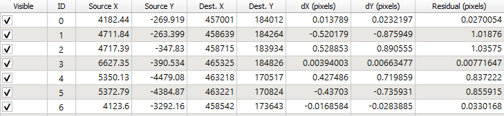

# Georeferencing Historical Lincoln

For my final project, I georeferenced a historical map of Lincoln, Vermont and digitized the river system. Georeferencing involves assigning real-world coordinates to a non-geolocated image in order to locate the map extent of the image in space. I originally wanted to digitize the rivers of an historical map and compare them to current river data in order to determine if the rivers have shifted over time. However, I found that the rivers lifted from the historical map are offset from the current data. This means either that the georeferencing is not completely accurate or that the depiction of the rivers on the historical map is slightly incorrect. 

[Click Here](/finalmap/index.html) to check out my leaflet map. Toggle the list of layers on the right to view the Open Street Map baselayer, the clipped hisotical map of Lincoln, the current river data from VCGI, and the digitized river set from the historical map.

### Data 

1. Historical [map](historicallincolnjpg.jpg) of Lincoln from the [Middlebury College Map Collection](https://archive.org/details/middleburycollegemaps)

2. VT Hydrology Dataset from [Vermont Center for Geographic Information](http://geodata.vermont.gov/). The river dataset for the whole state is too large to upload to this platform, but you can download the clipped river set for Lincoln [here](vcgiriversnew.shp) 

3. [Town boundaries](VT_Data_E911specific_Town_Boundaries.shp) from VCGI under the title "VT_Data_E911specific_Town_Boundaries.shp)

### Platforms and Plugins

* QGIS version 3.8.1
* GIS2Web plugin 
* GDAL raster (if not already automatically installed) 

All work was done in Stateplaine VT 1983 EPSG: 103172. 

## Methods

### Uploading the Map and Town Data

First, I had to choose an historical map to reference. I knew I wanted to digitize rivers in historical maps so I chose a town with plenty of rivers running through it and uploaded this image as a raster .tif into QGIS. Below is the image I settled on. 

 

I knew that I would have to have a geolocated shapefile of the town to which I could match the historical map, so I downloaded Vermont's town boundaries from VGI. I could now pull the coordinates from this shapefile into the historical map.

### Georeferencing

I used the GDAL Raster Georeferencer under GDAL Raster tools. I uploaded the historical map into the viewer. I clicked on points along the the town's boundaries on the historical map and then on the corresponding locations on the geolocated shapefile. As you click, Ground Control Points (GCPs) appear on the bottom of the screen. These points contain latitude and longitude coordinates from the geolocated shapefile and correspond to points on the historical map. Once you have selected more than 6 GCPs, the column "Residual (Pixels)" is populated with a number that indicates the level of uncertainty or error in each point. The lower the number the more accurate your GCPs and therefore your georeferencing. 

Here are my GCPs. As you can see, the Residual number is relatively low, indicating high accuracy. 

 

You can download my GCPs as points [here](
