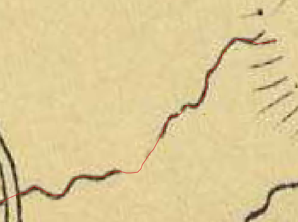

# Georeferencing Historical Lincoln

For my final project, I georeferenced a historical map of Lincoln, Vermont and digitized the river system. Georeferencing involves assigning real-world coordinates to a non-geolocated image in order to locate the map extent of the image in space. I originally wanted to digitize the rivers of an historical map and compare them to current river data in order to determine if the rivers have shifted over time. I found that the rivers lifted from the historical map are offset from the current river data. This means either that the georeferencing is not completely accurate or that the depiction of the rivers on the historical map is slightly incorrect. 

[Click Here](/finalmap/index.html) to check out my leaflet map. Toggle the list of layers on the right to view the Open Street Map baselayer, the clipped historical map of Lincoln, the current river data from VCGI, and the digitized river set from the historical map.

### Data 

1. Historical [map](historicallincolnjpg.jpg) of Lincoln from the [Middlebury College Map Collection](https://archive.org/details/middleburycollegemaps)

2. VT Hydrology Dataset from [Vermont Center for Geographic Information](http://geodata.vermont.gov/). The river dataset for the whole state is too large to upload to this platform, but you can download the clipped river set for Lincoln [here](vcgiriversnew.shp) 

3. [Town boundaries](VT_Data_E911specific_Town_Boundaries.shp) from VCGI under the title "VT_Data_E911specific_Town_Boundaries.shp)

4. OSM Standard from Open Street Maps. 

### Platforms and Plugins

* QGIS version 3.8.1
* GIS2Web plugin 
* GDAL raster (if not already automatically installed) 

All work was done in Stateplaine VT 1983 EPSG: 103172. 

## Methods

### Uploading the Map and Town Data

First, I had to choose an historical map to reference. I knew I wanted to digitize rivers in historical maps so I chose a town with plenty of rivers running through it and uploaded this image as a raster .tif into QGIS. Below is the image I settled on. 

 
Lincoln, Vermont. 1855. 

I knew that I would have to have a geolocated shapefile of the town to which I could match the historical map, so I downloaded Vermont's town boundaries from VGI. I could now pull the coordinates from this shapefile into the historical map.

### Georeferencing

I used the GDAL Raster Georeferencer under GDAL Raster tools. I uploaded the historical map into the viewer. I clicked on points along  the town's boundaries on the historical map and then on the corresponding locations on the geolocated shapefile. As you click, Ground Control Points (GCPs) appear on the bottom of the screen. These points contain latitude and longitude coordinates from the geolocated shapefile and correspond to points on the historical map. Once you have selected more than 6 GCPs, the column "Residual (Pixels)" is populated with a number that indicates the level of uncertainty or error in each point. The lower the number the more accurate your GCPs and therefore your georeferencing. 

Here are my GCPs. As you can see, the residual numbers are relatively low, indicating high accuracy. Publishing your GCPs with the residual numbers is an important step GIS users can take to make their studies more trustworthy and reproducible. Publishing a study about georeferencing without including your level of error is misleading and can lead to the proliferation of incorrectly georeferenced maps. Additionally, if these georeferenced maps are used for further data analyses or other studies, the error gets propagated over and over. 

 

You can download my GCPs as points [here](historicallincolnjpg_modified.tif.points) 

Under Transformation Settings, I selected "Polynomial 2" as my Transformation Type and "linear" for the Resampling Method. Make sure to select the correct Target SRS. Click "Start Georeferencing."

In order to check that the georeferencing worked I laid the town boundaries over my newly georeferenced historical to see if the boundaries lined up (see below). The bright pink lines are the town boundaries from VCGI. They line up!

 

Notice how the historical boundaries extend beyond the current town boundaries. I figure this is just a result of changing political boundaries between 1855 and now and do not believe that it indicates an error in the georeferencing. 

### Digitizing Rivers

I wanted to digitize the rivers of the historical map in order to compare them to current river data in Lincoln. I added a vector layer "rivers" and began drawing lines over the rivers with "Add Line Feature." Make sure to toggle editing beforehand. I added a different line feature for every tributary so that the line segments remained small. This is a long process and takes a lot of patience, so limiting the time it takes to redo a line segment is paramount. Check out my progress in the image below.

There were a few spots where the ink for the historical map has worn or perhaps was not drawn thick enough and I had to estimate the route of the river. 

 

Finally, I had completed the river vector layer for the historical map. You can downloaded this dataset [here](rivers.shp).

### Comparing Current River Data

I downloaded the current river data set for Lincoln from VCGI and uploaded it to QGIS. This dataset contains all the rivers and tributaries in Vermont, but I only needed the rivers in Lincoln, so I performed an intersection with the VCGI rivers as the input layer and the town boundary for Lincoln as the overlay layer. Before doing that I extracted the Lincoln town boundary from the Vermont town boundary layer using Select by Expression ("'TOWNNAME' = 'LINCOLN'").

The rivers that I digitized from the historical map and the current river data set do not match. At first, I thought maybe the current river data set was incorrect so I cross-referenced it with the rivers on the OSM Standard basemap from Open Street Maps. Unfortunately for me, the VCGI rivers are of course correct. Interestingly, it seems as those the two datasets are offset from each other. Notice the circled areas in the image below. 

 

### Uploading to Leaflet

When thinking about how to present my map as an interactive webmap, I wanted to highlight the main goal of the project which was to locate historic Lincoln in its actual locataion in space. I decided to show historical Lincoln as if it was a puzzle piece that fits nicely into current town boundaries and overlayed on the OSM basemap. In order to do this I had to cut out the actual map of Lincoln from the rest of the historical image. In order to do so I used Clip Raster by Extent from the "Clipper" tools for Raster. I used the historical map as the input and clipped it by the Lincoln town boundary from VCGI. Make sure to add "0" to the no data value or everything that has been masked will appear black. Now the historical map has been isolated from the rest of the image and fits into the town boundaries.

I used the QGIS2WEB plugin to upload my final map to Leaflet. Leaflet is a great platform that we have used previously in class to create user-friendly web maps. I followed Professor Holler's directions on using this program to ensure that my map would come out as I wanted. I made sure to click only the layers I wanted to display and click "expanded" for "Add Layers List" in the "Appearance" tab in order to create a toggle-able legend. I selected 19 as my zoom level and 15 for my precision level. Then I exported! 

Make sure to edit the output html file to fit your symbology preferences. Below is a screengrab from the section of the html where you can edit a feature layer's symbology.

You can also add a scale bar by adding the line L.control.scale() .addTo (map) ; to the end of the JavaScript, right before the final </script>.

## Conclusion

In this lab, I learned how to georeference a historical map and digitize feature layers. I revisited uploading a QGIS map to leaflet which we had done in a previous lab. Georeferencing historical maps is a great exercise for anyone interested in how different land features and human-made features change over time as well as mapping techniques. 

I am still puzzled by why the VCGI rivers do not line up with the rivers I digitized. At first I thought that I needed more GCPs to make the georeferencing more accurate so I added some GCPs on points on the two respective river sets that I suspected were the same point in real life. However, after running the georeferencer, the addition of these points caused the numbers for the residual table to skyrocket. This tells me that the mis-match is not due to a georeferencing error but lies in incorrect measurements of the rivers on the historical map. Of course, there is always the possibility that the rivers actually have moved that substantially and that the points that I identified as offsets are just flukes. 

