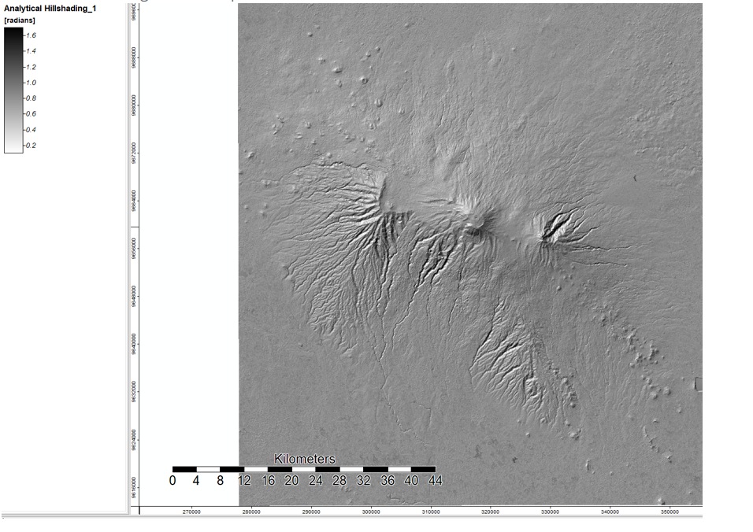
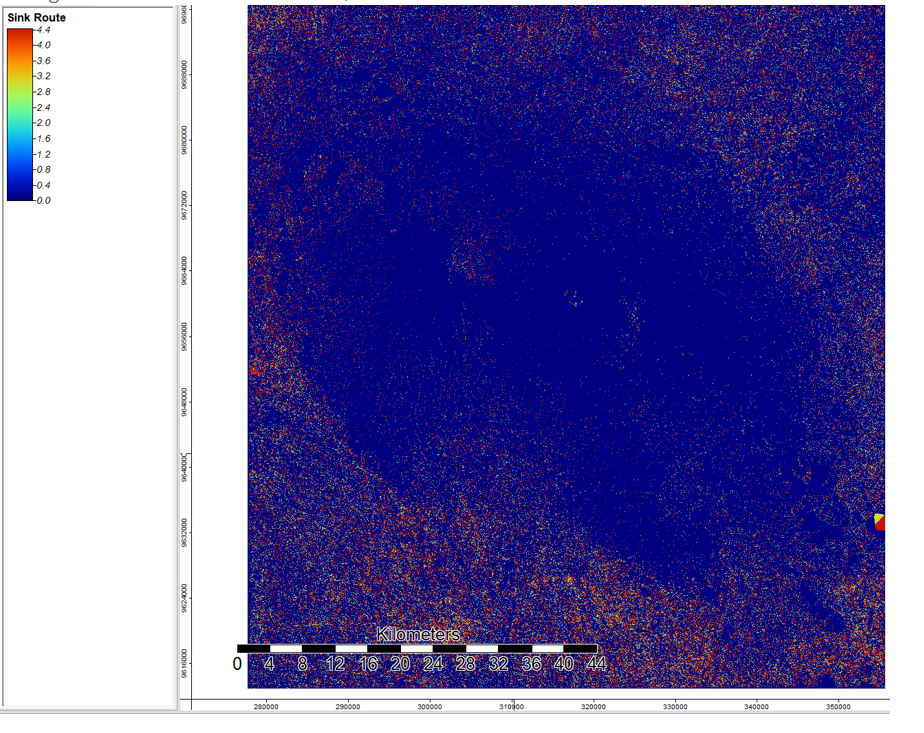
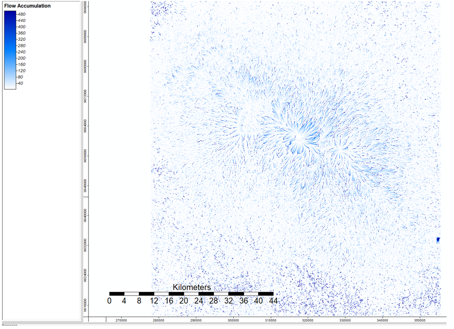

# Global Digital Elevation Models (DEM) and Assessing Error Proagation and Uncertainty 

## Stream Channel Analysis of Mount Kilimanjaro, Tanzania 

This week, we expanded our work in lab 3 by using a cammand prompt batch process to complete the hydrological workflow for Kilamanjaro, Tanzania. The batch process method is helpful because one could theorhetically run the model without even having a gis open on their computer. Additionally, the user can simply switch out inputs for different data sources or geographical regions. We also used both ASTER and SRTM data and compared the number (error) files in order to determine which data collection system is more accurate for particular landscapes.

## Data Acquisition

We accessed DEM and NUM files from Earth Data. I downloaded the SO4E037 AND S03EO37 tiles which extend north and south of Mt. Kilamanjaro. The ASTER data is from the US and Japan Science Teams and the SRTM data is from NASA. We used a [python script](srtmNUMtoSAGA.py) provided by our professor, Dr. Joseph Holler, in order to conver the NUM data into usable grids. 

## Making the DEM 

I conducted this analyses on SAGA open source GIS. First, I mosaicked the DEMS and projected them into the correct coordinate system (UTM Zone 37) from the WGS projection. I then applied a hillshade with azimuth 315 and height 45 in order to better visualize the terrain.

Next I established where the sinks are in the terrain so that they could be filled for a more accurate hydrological model.

 

I then ran a flow accumualation tool. As you can see below, darker areas have greater flow accumulation. Once this value reaches a certain threshold, we can determine that there is a stream present.

 

Finally, I ran a channel network and overlaid it onto my hillshade in order to see how the streams lie on the topographic landscape. 

## Assessing Error

One of the goals of this lab was to assess and compare the levels of error and uncertainty between ASTER and SRTM. These programs work by collecting data from particular locations at varying angles and positions. Some areas are harder to capture than others, which forces the collector to source data from other places or interpolate data from nearby areas. The NUM files are raster layers in which each cell contains a number that corresponds to a distinct data source. If any data has been interpolated from a source other than ASTER or SRTM, it will show up on the map.

Here is the NUM map for SRTM:

 

The grey space demonstrates that the data for that site was collected by SRTM. 

Here is the NUM map for ASTER:

 

The blue space demonstrates that the data for that site was collected by ASTER. 

After running the number files, I subtracted the ASTER DEM from the SRTM DEM in order to assess inconsistencies between the two data sources and to determine in which particular regions these inconsistencies lay. 

.PNG

Where the pixels are more blue or more red, there is more inconsistancy between the two data sources. The areas that are whiter demonstrate more agreement and therefore cerainty. As you can see by comparing the following two images with the hillshade, the areas of greater uncertainty are in the higher elevations. There is a area of marked uncertainty at the lake on the base of the mountain. This may be because it is very hard for ASTER and SRTM to determine direction of flow or elevation on the lake's surface.

[Here](ASTERDEM.bat) is my ASTER batch process.
[Here](SRTMDEMproj.bat) is my SRTM batch process. 

Data Sources: NASA/METI/AIST/Japan Spacesystems, and U.S./Japan ASTER Science Team. ASTER Global Digital Elevation Model V003. 2019, distributed by NASA EODIS Land Processes DAAC

NASA JPL. NASA Shuttle Radar Topography Mission Global 1 arc second. 2013, distributed by NASA EOSDIS Land Processes DAAC

Ran using SAGA version 6.2
