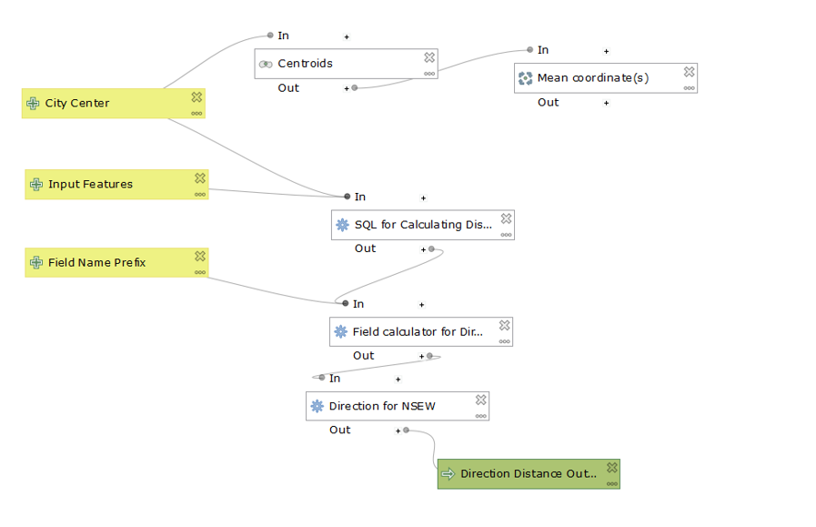

## My First QGIS Model

In the first lab we created a processing model to measure the distance and direction from a point. 
In the class tutorial, we focused on Chicago and compared the distance and direction from the CBD to median gross rents in the city. Later, we downloaded our own data of a different geographic location and performed the same analysis to generate a scatterplot and polarplot of the same metrics at our new location. I choose to focus on my hometown of Boston, MA. I succeeded in using the model to generate distance and direction data but when I went to plot my distance results I found that distance was being measured in degrees. I am working on understanding how that happened and fixing that error.

Someone interested in performing this distance/direction analyses, perhaps interested in the distance-decay function of various phenomena can use this model to analyze any city and its surrounding area. When analyzing a new geographic location, the user should select the polygons (census tracts in my example) that make up the city center. The model then uses the Mean Coordinates tool to establish a point for the city center (CBD). During the second week, I added an Execute SQL function to the model to caluclate distance. Using SQL was not the smoothest route to take- it took time to debug the tool and ensure that the outputs were correct. Additionally, the tool does not alert you to syntax errors like other tools in Q do.

This lab is a good example of the kind of work one can do with an Opensource software as opposed to a closed software with ESRI. Being able to minipulate the code is crucial for personalized workflows and helps the user understand the program more thouroughly. In the context of the GIS as a tool vs science debate (Wright, Goodchild, Proctor, 1997), this lab confirmed my initial understanding of GIS as a tool. Tinkering with the code matched more closely the experience of modifying a tool than it did a science. Additionally, using an Opensource GIS and modifying the code presents a challenge to the human geography doctrinares who believe that GIS geographers are inherently rigid in their use of corporate GISs like that developed by ESRI (Martin et al. 2007). This lab proved that there are ways to insert ones own ideas into a GIS workflow and disrupt the presumed linearality of GIS (ibid.). Finally, "rewiring" the code allowed us to perform an analyses that could serve the interests of the public (Sieber 2004).  

For the purposes of this assignment I chose to upload the scatter and polar plots for the chicago data. 
Below are three metrics: Distance from the CBD, Direction from the CBD, and Median Gross Rent by census tract.

 

 

Below is a screengrab of my model
 

[Model]

[Scatterplot of distance from Chicago CBD vs Median Gross Rent](Scatter_Medgrossre.html) 

[PolarPlot of direction from Chicago CBD vs Median Gross Rent](PolarPlot_direction_Medgrossre.html)

[back to Main Page](index.md)

References

Martin, Kevin St., and John Wing. “The Discourse and Discipline of GIS.” Cartographica: The International Journal for Geographic Information and Geovisualization, vol. 42, no. 3, 2007, pp. 235–248.

Sieber, R. “Rewiring for a GIS/2.” Cartographica: The International Journal for Geographic Information and Geovisualization, vol. 39, no. 1, 2004, pp. 25–39.

Wright, Dawn, and Michael Goodchild and James Proctor.
Demystifying the Persistent Ambiguity of GIS as ‘Tool’ versus ‘Science’. 1997. 
