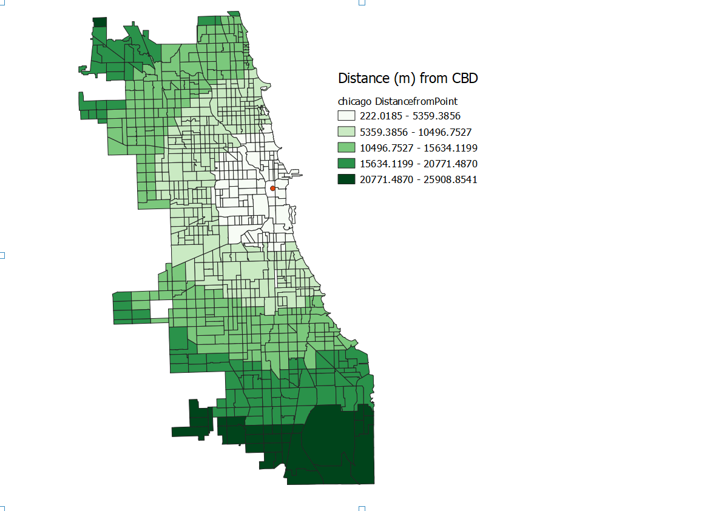
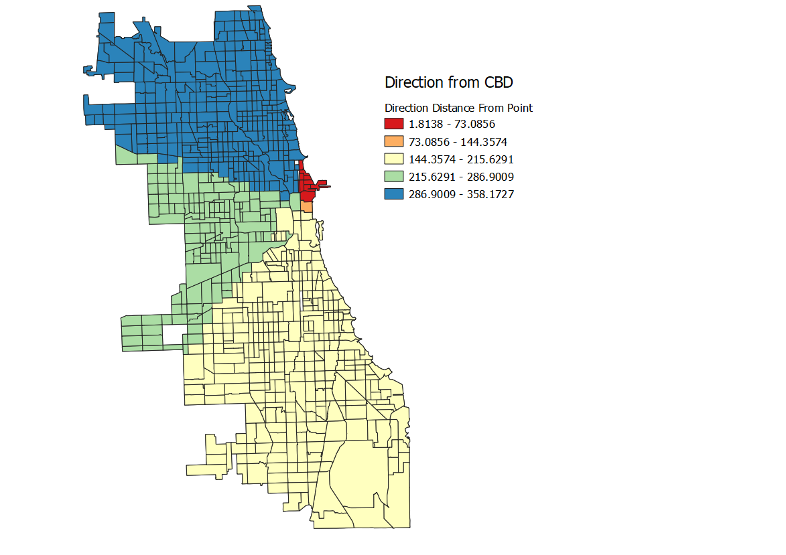
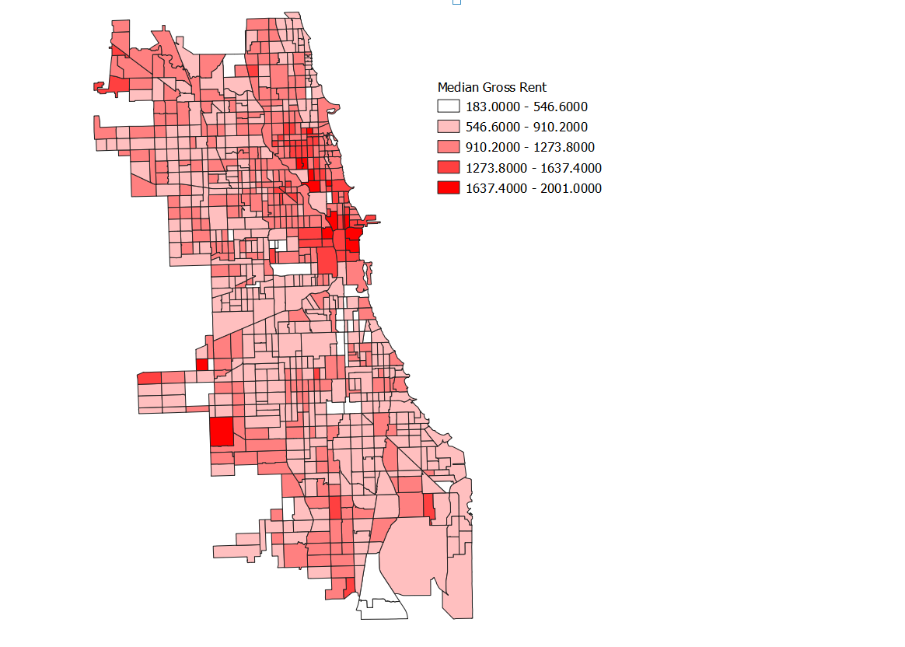

## My First QGIS Model

In the first lab we created a processing model to measure the distance and direction from a point. 
In the class tutorial, we focused on Chicago and compared the distance and direction from the CBD to median gross rents in the city. Later, we downloaded our own data of a different geographic location and performed the same analysis to generate a scatterplot and polarplot of the same metrics at our new location. I choose to focus on my hometown of Boston, MA. I succeeded in using the model to generate distance and direction data but when I went to plot my distance results I found that distance was being measured in degrees. I am working on understanding how that happened and fixing that error.

For the purposes of this assignment I chose to upload the scatter and polar plots for the chicago data. 
Below are three metrics: Distance from the CBD, Direction from the CBD, and Median Gross Rent by census tract.

 

 

[Model](distance_from_point.model_9_12.model3) 

[Scatterplot of distance from Chicago CBD vs Median Gross Rent](Scatter_Medgrossre.html) 

[PolarPlot of direction from Chicago CBD vs Median Gross Rent](PolarPlot_direction_Medgrossre.html)

[back to Main Page](index.md)

