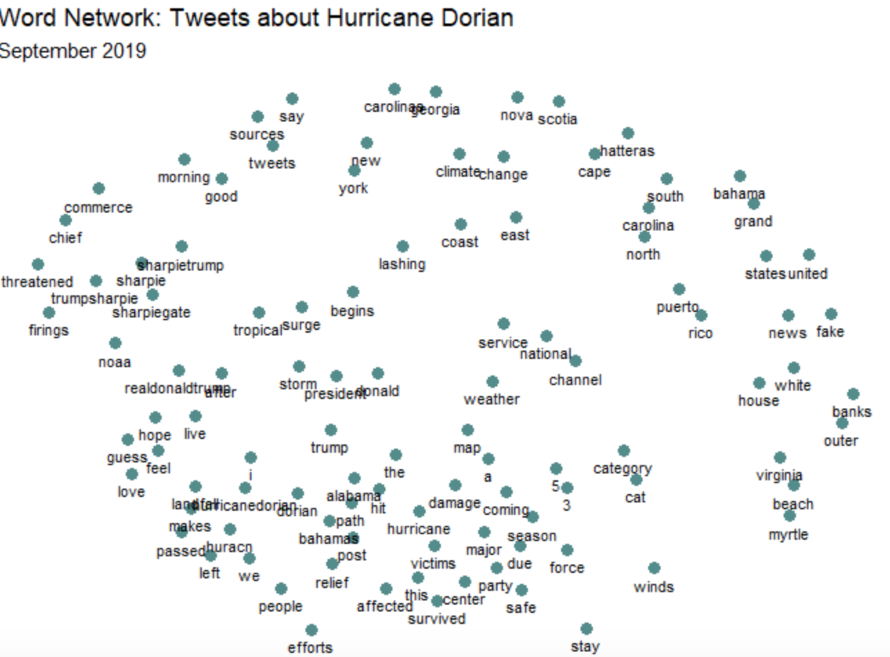
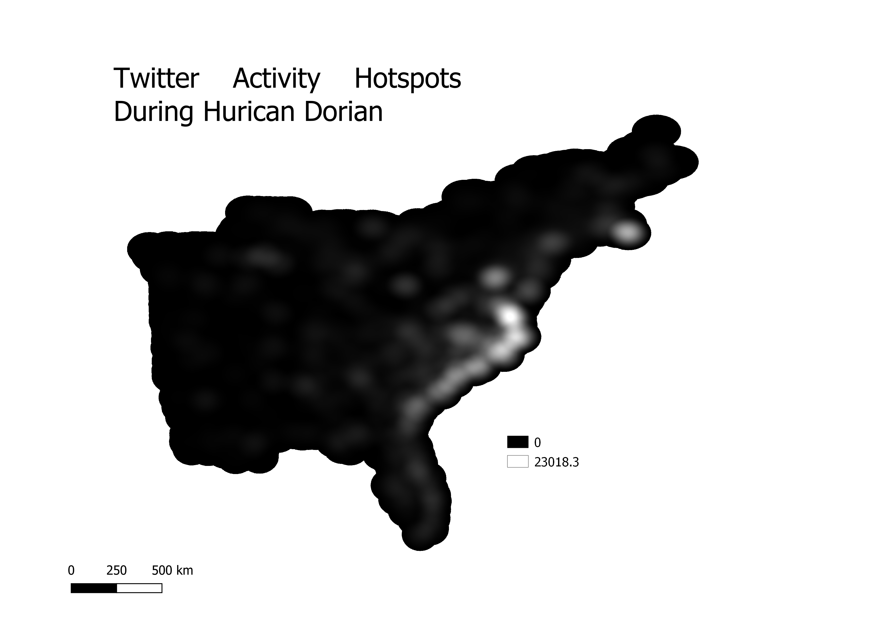
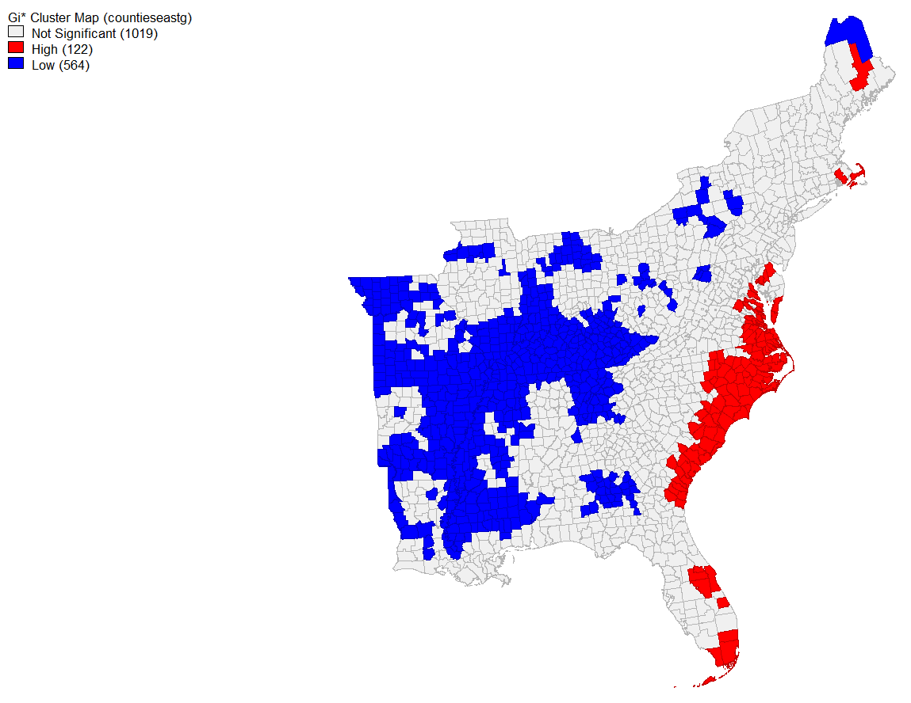

# Twitter Hotpost Analysis: Tweets During Hurican Dorian 

For our final lab of the semester, we learned how to access Twitter data through their API platform, execute a query for particular words, and perform a spatial analysis of these queried tweets. Accessing this information throught the Twitter API is particularly powerful because we can get tweets in real time. However, spatial analysis of Twitter data can be difficult becuase only about 1% of all tweets have their geo-location enabled. Twitter solves this problem by generalizing the tweets to their respective neighborhood, city, or sometimes country, depending on what invormation the user has provided in her profile or her settings. In this lab, we sought to determine whether people in regions impacted by Hurricane Dorian (or thought to be impacted- see "Sharpiegate") tweeted more during Dorian than on average during the month of November. 

## Methods

### Data Sources

1. Twitter data, accessed using this [R script](twitterForLab.r) provided by Prof. Holler. Make sure to sign up for a Developer Account and [apply](https://developer.twitter.com/en/apply-for-access) for a Twitter API 
2. [November Tweets CSV](novemberData.csv) 
3. [Dorian Tweets CSV](dorianData.csv) 
4. US Census data, accessed through the R scripts. 

### Softwares and Platforms

* QGIS 3.8.1
* Twitter
* RStudio
* GeoDa

[Here] you can download the SQL Code in POSTGIS for QGIS
### Procedure

#### Twitter Acquisition

In order to access the tweets I wanted for my analyses, I used the "search_tweets" function in RStudio and searched for "Dorian" and optained 200,000 tweets that inluded this word. We also downloaded 200,000 tweets from November 19, 2019 to serve as our baseline indicator of twitter activity. We named this layer "November". We then used the "lat_long" query to convert the GPS coordinates of the geolocated tweets into lat lng columns. We then selected all of the geolocated tweets by using a "subset query". We then converted the geographic bounding boxes of our tweets into centroids for our lat lng columns. 

#### Content Analysis

Before generating a hotspot map in Q I wanted to find what the most common words in these tweets were as well as develop a word association map. 

First, I had to get the plain text of the tweets without things like URL links, spaces and apostrophes by using the "plain_tweets" function into the text column of my database. Then I used "select" and "unnest_tokens" to split the column into word tokens" 

Then, I had to remove "stop words", words such as "and" and "but" that hold no actual baring on the content of the tweets. I included "t.co" in this list to remove unnecessary links. Then I used "anti_join" to find all the word tokens that were not stop words. I used ggplot to graph the edited list of the 20 most common words:

Perhaps unsurprisingly, "Hurricane" and "Dorian" were the most common words in all of the tweets, followed far behind by "Alabama" and "Sharpiegate". These last two words indicate an interest in Trump's infamous presentation in which he used a sharpie to try argue that Dorian would hit Alabama. 

In order to create a word association graphic, I used "unnest_tokens" to get word pairs from all the tweets of interested and then used "separate" to spit the column into two. I used the "count" function to count the number of associations for each word. 

 

#### Upload to PostSQL database, Spatial Analyses

I first uploaded all of my data tables to my PostGIS database. Then I added geometries to my data frames and transformed them into the correct CRS (SRS code: 102004). Then, I selected only the counties in the Eastern US, our area of interest, and deleted the rest. I then added a "count" column for each table of tweets ("Dorian", or "November") by county.

Finally, we normalized the data in an effort to protect user privacy. We added a "tweetrate" column for each tweet layer and calculated the number of tweets per 10,000 people. We also calculated a Normalized Tweet Difference Index (NTDI) which assigned each county a score of -1 to 1, indicating low to high activity. 

NTDI formula: (doriantweets - novembertweets * 1.0)/(doriantweets + novembertweets) 

Now that we had a normalized and geographically indexed activity rate, we could perform a spatial analyses and get a kernel density map. 
First, I converted the counties shapefile into centroid points and used the Kenel Density tool to generate a heatmap with a radius of 100 kilometers and a pixel size of 500:

 

We can see in this map that the areas with higher Dorian-related twitter activity correspond with the regions most impacted by the hurricane.

Next, I wanted to created a spatial culter map of tweets related to Dorian. I opened GeoDa cand created a spatial wights matrix using the "Weights Manager" tool. Then, I created a local G* cluster map. 

 

Here, we see again that the areas with significantly high twitter activity correlate to the regions most affected by the hurricane. Alabama, the state that was supposedly supposed to also be hit, does not appear to have a higher than average rate of activity.

In this age of big data, spatial scientists have unprecendented access to information on anything from public sentiment, to natural hazard vulnerability and response. Being able to access this huge wealth of information can be overwhelming and because if its relative novelty, the standards for big data mining have not be fully developed or widely accepted.
